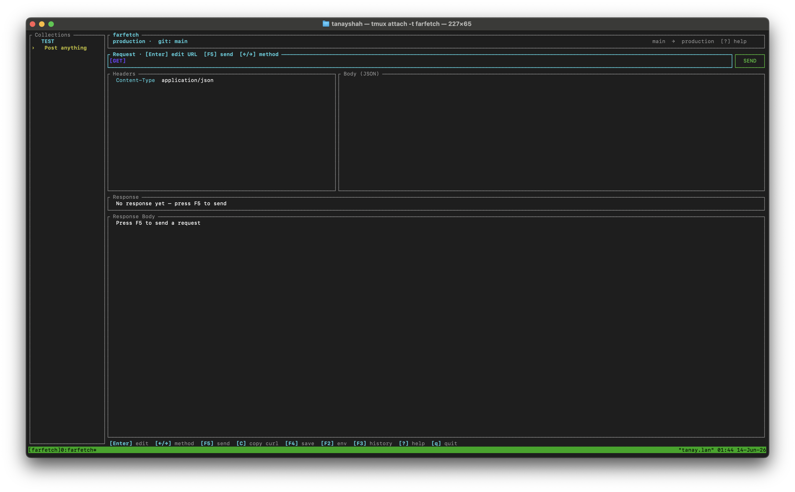
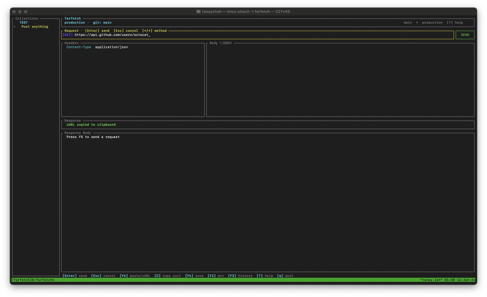
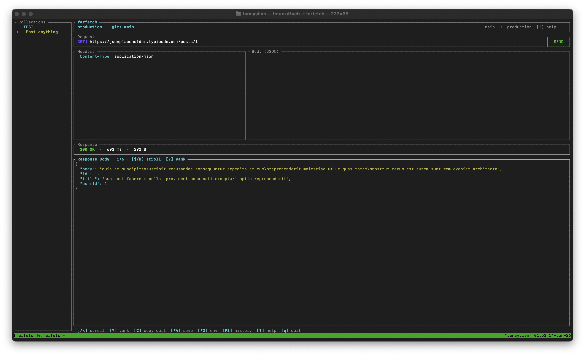
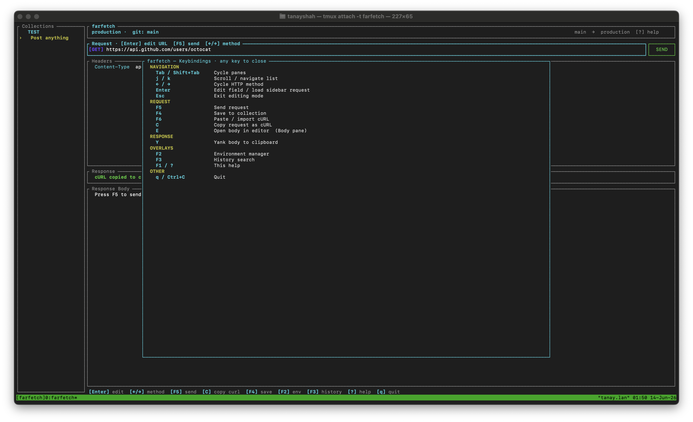
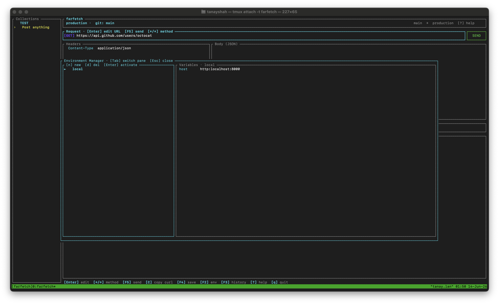
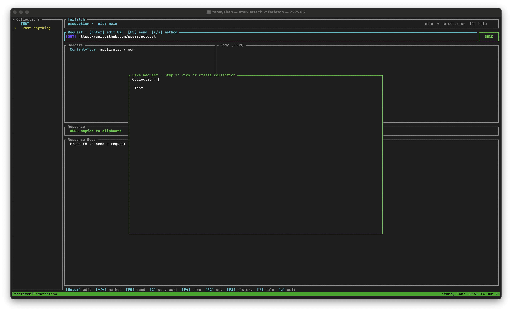

# farfetch 🦀

An open-source, keyboard-driven TUI API client built in Rust. No bloat, no cloud sync — instant ad-hoc requests, smart cURL import, environment switching tied to your Git branch, and a persistent request collection — all in under 15 MB of RAM.

> **A lightning-fast, zero-config REST client? Sounds *farfetch'd*.**

[](https://opensource.org/licenses/MIT)

---

## Features

- **Zero-config scratchpad** — launch, type a URL, press `F5`. No project setup needed.
- **Persistent collections** — `F4` saves any request to a named collection. Sidebar loads it in one keystroke.
- **Git-branch environment syncing** — link environments to branch patterns (`feature/*`, `main`). Switching branches auto-resolves the right host URL and token set.
- **`{{VAR}}` substitution** — use template variables in URLs and headers. Values are resolved at fire time from the active environment — raw templates stay visible while editing.
- **Smart cURL import** — `F6` pastes a raw `curl` string (from DevTools or a colleague) and populates every field: method, headers, body.
- **Request history** — every fired request is appended to `.farfetch/history.json` (capped at 500). `F3` opens a fuzzy search over the full history.
- **External editor hand-off** — `E` on the body pane opens a temp buffer in your `$EDITOR`. Save and close; the body updates instantly.
- **Copy as cURL** — `C` generates a shell-ready `curl` command for the current request and copies it to the clipboard.
- **Syntax-highlighted responses** — JSON responses are colorized in the response pane.
- **Microscopic footprint** — native binary, no runtime, under 15 MB RAM at 60 FPS idle.

---

## Screenshots

**Main interface** — sidebar, request pane, headers/body editors, and response viewer:



**Typing a URL** — URL bar highlighted, Editing mode active:



**Live JSON response** — syntax-highlighted body, status bar shows 200 OK, timing, and size:



**Help overlay** — full keybinding reference (`?` or `F1`):



**Environment manager** — create/switch environments, edit `{{VAR}}` variables (`F2`):



**Save to collection** — two-step prompt to pick or create a collection (`F4`):



---

## Keybindings

| Key | Action |
|---|---|
| `Tab` / `Shift+Tab` | Cycle focused pane |
| `Enter` | Enter editing mode on URL or Body pane |
| `Esc` | Exit editing mode |
| `F5` | Send request |
| `←` / `→` | Cycle HTTP method (URL pane, Normal mode) |
| `j` / `k` | Scroll response / navigate headers |
| `Y` | Yank response body to clipboard |
| `E` | Open body in external editor (Body pane) |
| `C` | Copy request as cURL |
| `F4` | Save request to collection |
| `F3` | Fuzzy-search request history |
| `F6` | Paste cURL string and auto-populate fields |
| `F2` | Open environment manager |
| `F1` / `?` | Toggle help overlay |
| `q` / `Ctrl+C` | Quit |

---

## Workspace layout

Configuration lives in `.farfetch/` next to your project (or in `~/.farfetch/` as a fallback). All files are plain JSON — safe to read, diff, and commit (except `environments.json` which holds secrets).

```
.farfetch/
├── config.json          # Branch→environment mapping, editor preference
├── environments.json    # API keys and base URLs (add to .gitignore)
├── collections.json     # Saved requests (safe to commit)
└── history.json         # Auto-appended request history (last 500)
```

Example `config.json`:

```json
{
  "git_branch_mapping": {
    "main": "production",
    "release/*": "uat",
    "feature/*": "local",
    "bugfix/*": "dev"
  },
  "default_editor": "zed",
  "danger_accept_invalid_certs": false
}
```

Example `environments.json`:

```json
{
  "local": {
    "host": "http://localhost:8080",
    "token": "dev-token-abc"
  },
  "production": {
    "host": "https://api.example.com",
    "token": "prod-token-xyz"
  }
}
```

With these files in place, a URL like `{{host}}/api/v1/users` resolves automatically based on the current Git branch.

---

## Getting started

**Prerequisites:** Rust toolchain via [rustup.rs](https://rustup.rs).

```bash
git clone https://github.com/Tanay-27/farfetch.git
cd farfetch
cargo build --release
./target/release/farfetch
```

For live reloading while developing:

```bash
cargo install cargo-watch
cargo watch -x run
```

---

## Contributing

Check open issues for `good first issue` or `help wanted` tags. Open a discussion before large feature work.

```bash
cargo fmt --check
cargo clippy
cargo test
```

Fork → branch (`feature/my-thing`) → PR against `main`.

---

## License

MIT — see [LICENSE](LICENSE).
